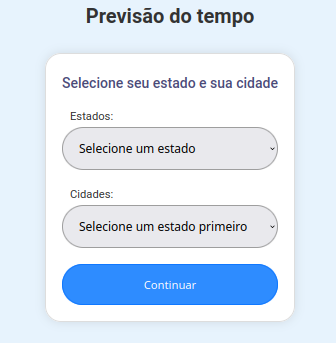
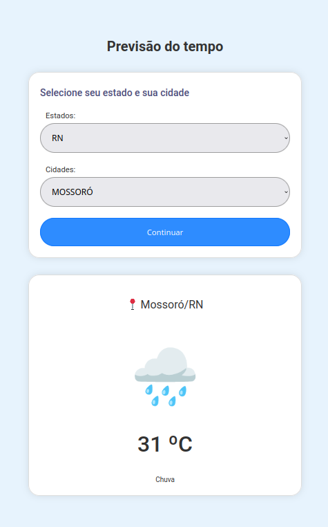

# 🇧🇷 [Explorer-ECP] - Explorador de Estados, Cidades e Previsões do Tempo 🌡️☀️🌥️☔

#### 🔎 Escolha um estado brasileiro para explorar suas cidades, e descubra as condições climáticas atual da localidade.


<div align="center">
    
     <p>Tela de Seleção de Estados e Cidades</p>
</div>

***

### 📝 Funcionalidades
* Esta aplicação web oferece uma experiência abrangente, permitindo aos usuários explorar todos os estados brasileiros. Os usuários podem selecionar um estado de interesse, visualizar a lista de suas cidades e, ao escolher uma cidade específica, obter informações instantâneas sobre a temperatura e as condições climáticas atuais naquele local.

* Para garantir a precisão e a atualização constante dos dados, utilizamos três APIs disponíveis em https://brasilapi.com.br/. Essas APIs fornecem informações detalhadas sobre estados, cidades e dados meteorológicos.
***

### 🔧 Tecnologias Utilizadas
         
***
### 🗃️ Organização Estrutural de Diretórios e Arquivos
```
sprint-2-pb-aws-ifsul-ufersa
├── src
│   ├── backend
│   │   ├── controllers
│   │   │   ├── allCitiesByStateController.js
│   │   │   ├── allStatesController.js
│   │   │   └── weatherByCityController.js
│   │   ├── routes
│   │   │   ├── allCitiesRouter.js
│   │   │   ├── allStatesRouter.js
│   │   │   ├── home.js
│   │   │   └── weatherByCityRouter.js
│   │   └── app.js
│   ├── frontend
│   │   ├── static
│   │   │   ├── css
│   │   │   │   └── style.css
│   │   │   └── js
│   │   │       └── index.js
│   │   ├── index.html
│   │   └── public
│   │       └── assets
│   │           └── 01.png
├── .env.example
├── .gitignore
├── README.md
├── package-lock.json
└── package.json
```
### 📚 Instruções de instalação
 1. Faça o download do diretório disponível no Github utilizando a branch 'equipe-6' para o seu computador:
```
   https://github.com/Compass-pb-aws-2024-IFSUL-UFERSA/sprint-2-pb-aws-ifsul-ufersa.git
```
  2. Instale no computudor o Node.Js disponivel em:
```
    https://nodejs.org/en/download/current
```
  3. Configure um arquivo .env para conter a seguinte informação:
 ```
 PORT=3000
 ```
  4. Dentro do diretório baixado, abra um terminal e instale o gerenciador de pacotes para a plataforma Node.js, conhecido como NPM (Node Package Manager),Este comando instalará todas as dependências do projeto listadas no arquivo package.json, para isso utilize o seguinte comando:
 ```
 npm install
 ```
  5. Ainda dentro do terminal, execute o seguinte comando para iniciar o servidor de desenvolvimento em projetos Node.js:
  ```
  npm run dev
  ```
  6. Para executar a aplicação, abra um novo navegador web e digite o seguinte endereço na barra de endereços:
  ```
  http://localhost:3000/
  ```
  7. Agora, você pode começar a utilizar a aplicação.
***
### 📲 Instruções de Uso
1. Escolha o estado desejado na lista para visualizar todas as suas cidades.
2. Selecione uma das cidades listadas para verificar as condições climáticas.
3. Clique botão "Continuar".
***
### ⌨️ Exemplo de Uso
<div align="center">
    
     <p>Apresentação das condições meteorológicas assim que o usuário seleciona o estado e a cidade desejados</p>
</div>

***
### 📊 Dificuldades enfrentadas e superadas

- 📎  Definição do tema a ser desenvolvido.
- 📎  Escolha da metodologia de trabalho mais adequada ao projeto: Optamos pela abordagem de modularização, complementada por revisões após a conclusão de cada parte.
***
### 💻 Desenvolvedores --- Equipe-06
- 📌 [Carlos Azevedo](https://github);
- 📌[Levy Martins](https://github.com/levynascimento);
- 📌[João Sales](https://github.com/jovitif/jovitif);
- 📌[Roger Matheus](https://github.com/rogerlasch);
- 📌[Thiago Coelho](https://github.com/thiagocoelhoo)
***