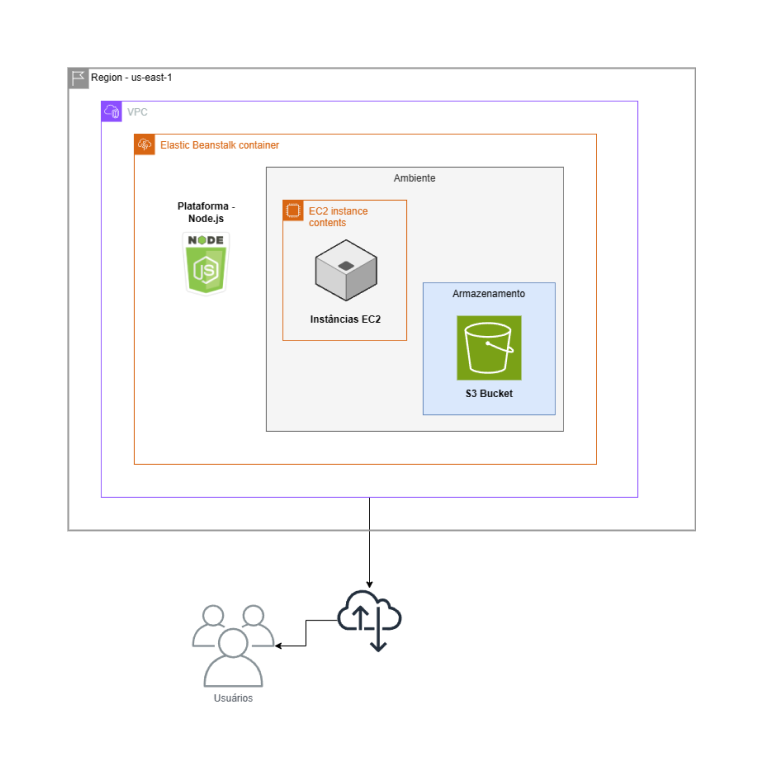

# API - Projeto

O seguinte repositório remoto diz respeito a avaliação da quarta sprint do programa de bolsas Compass UOL para formação em machine learning para AWS. Para essa, foi desenvolvido em Node.js uma API que consome duas diferentes API's (a ChuckNorris API e a BoredAPI) e retorna seus resultados, de forma organizada e formatada, em duas rotas distintas, além de uma rota principal apresentando informações básicas sobre a aplicação.

Após o desenvolvimento da API, também foi realizado o deploy da aplicação na AWS, através da utilização da ferramenta Elastic Beanstalk.

### Equipe desenvolvedora

- João Vitor Fernandes de Sales
- Luiz Fernando da Cunha Silva
- Rafael Araujo Abreu de Oliveira

***

## Índice

- [Desenvolvimento](#desenvolvimento)
  - [Desenvolvimento da API](#desenvolvimento-da-api)
  - [Desenvolvimento na AWS](#desenvolvimento-na-aws)
- [Dificuldades conhecidas](#dificuldades-conhecidas)
- [Utilizando o sistema](#utilizando-o-sistema)
  - [Ferramentas e tecnologias](#ferramentas-e-tecnologias)
  - [Tutorial para utilização](#tutorial-para-utilização)
    - [Pela AWS](#pela-aws-enquanto-o-serviço-estiver-ativo)
    - [Na sua máquina local](#na-sua-máquina-local)
- [Organização das pastas](#organização-das-pastas)
- [Testes](#testes)

***

## Desenvolvimento

O projeto foi desenvolvido em duas diferentes etapas: 1) o desenvolvimento da API; e 2) o deploy do projeto na AWS com o Elastic Beanstalk.

***

### Desenvolvimento da API

A API doi desenvolvida utilizando o node.js, e algumas de suas dependências (como Axios e Express), para realizar o consumo das API's ciatdas anteriormente. 

O desenvolvimento da API seguiu o seguinte plano:
1. O consumo das API's solicitadas para o projeto;
2. A filtragem e estruturação do retorno das API's originais para a formatação pedida;
3. Retornar os dados consumidos e formatados em diferentes rotas.

Também foi inserido na API uma rota para a documentação com o Swagger, onde também é possível realizar testes para o retorno das rotas da API.

***

### Desenvolvimento na AWS

O desenvolvimento do projeto na AWS envolveu o deploy da aplicação desenvolvida utilizando a ferramenta de orquestração Elastic Beanstalk. Tal ferramenta criou, após o envio do código para ela, os seguintes serviços na AWS: 1) um bucket no S3 contendo as versões do código da aplicação; 2) uma instância na EC2 para auxiliar na implantação da aplicação. Ainda foram utilizados os serviços AWS IAM e AWS VPC.

</img>

***

## Dificuldades conhecidas

Em relação as dificuldades no desenvolvimento do sistema, pode-se citar:

1. A solução de alguns erros ao decorrer do deploy na AWS;
2. Dificuldades pontuais no desenvolvimento da API.

***

## Utilizando o sistema

### Ferramentas e tecnologias

O sistema foi construído utilizando as seguintes ferramentas e tecnologias:

- Git - v.2.42.0
- Node.js - v.21.6.2
- Axios - v.1.6.7
- Express - v.4.18.3
- Dotoenv - v.16.4.5
- Swagger Autogen - v.2.23.7
- Swagger Ui Expres - v.5.0.0
- uuid - v.9.0.1
- Nodemon - v.3.1.0

Também foi feito o deploy do projeto na AWS, utilizando as seguintes ferramentas:

- AWS Elastic Beanstalk
  - AWS EC2
  - AWS S3
  - AWS VPC

***

### Tutorial para utilização

#### Pela AWS (enquanto o serviço estiver ativo)

Acesse o seguinte link:

```
http://grupo06-env.eba-jt483rwb.us-east-1.elasticbeanstalk.com/
```

<b>Para acessar cada rota específica:</b>

Rota de piadas:

```
http://grupo06-env.eba-jt483rwb.us-east-1.elasticbeanstalk.com/api/piadas
```

Rota de atividades:

```
http://grupo06-env.eba-jt483rwb.us-east-1.elasticbeanstalk.com/api/atividades
```

#### Na sua máquina local

Para utilizar essa aplicação no seu ambiente local, siga os seguintes passos:

1. Clone o repositório, especificando a branch 'equipe-6', usando o seguinte comando:

```bash
git clone -b equipe-6 https://github.com/Compass-pb-aws-2024-IFSUL-UFERSA/sprint-4-pb-aws-ifsul-ufersa
```

2. Navegue até o diretório do projeto e instale as dependências necessárias:

```node
cd path/to/project
npm install
```

3. Inicie o servidor com o seguinte comando:

```node
npm run dev
```

4. Em um navegador de sua escolha, acesse o [http://localhost:8080/](http://localhost:8080/).

***

## Organização das pastas

- src/
  - backend/
    - controllers/
      - [activityController.js](./src/backend/controllers/activityController.js)
      - [jokeController.js](./src/backend/controllers/jokeController.js)
    - models/
      - [Activity.js](./src/backend/models/Activity.js)
      - [Joke.js](./src/backend/models/Joke.js)
    - routes/
      - [activityRouter.js](./src/backend/routes/activityRouter.js)
      - [jokeRouter.js](./src/backend/routes/jokeRoute.js)
      - [mainRouter.js](./src/backend/routes/mainRoute.js)
    - service/
      - [activityService.js](./src/backend/service/activityService.js)
      - [jokeService.js](./src/backend/service/jokeService.js)
    - [index.js](./src/backend/index.js)
    - [swagger_output.json](./src/backend/swagger_output.json)
    - [swagger.js](./src/backend/swagger.js)

***

## Testes

Os testes do aplicativo foram feitos utilizando o navegador Edge versão 121.0.6167.185, instalado no sistema operacional Windows 11 Pro versão 121.0.2277.128. Pode haver alterações na funcionalidade e na exibição quando executado em ambientes diferentes. É possível execitar testes na aplicação utilizando o Swagger, para isso, basta acessar a rota '/api-docs', com o seguinte link:

```
http://localhost:8080/api-docs/
```