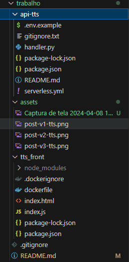

# Conversor de Texto para Áudio usando AWS Polly
Este projeto consiste em uma aplicação serverless que utiliza o serviço Polly da AWS para converter textos inseridos pelo usuário em arquivos de áudio MP3.

## índice
- [Desenvolvimento](#desenvolvimento)
- [Tecnologias utilizadas](#tecnologias-utilizadas)
- [Estrutura de pastas](#estrutura-de-pastas)
- [Mídias da aplicação](#mídias-da-aplicação)
- [Dificuldades conhecidas](#dificuldades-conhecidas)
- [Como utilizar](#como-utilizar)
- [Desenvolvedores](#desenvolvedores)

## Desenvolvimento
O projeto foi desenvolvido utilizando o framework Serverless em Python, com o objetivo de converter frases em áudios MP3 via AWS Polly e armazena os arquivos no Amazon S3. O projeto conta com handler em 'handler.py' para as funções Lambda da API.  O diretório 'views' contém o 'index.html' que  oferece uma interface básica para interagir com a API.

## Tecnologias utilizadas
<div style="display: inline_block">

  <table border="1">
    <tr>
        <th>Tecnologia</th>
        <th>Versão
    </tr>
    <tr>
        <td>  Python</td>
        <td>3.9</td>
    </tr>
    <tr>
        <td> Boto3</td>
        <td>1.34.74</td>
    </tr>
    <tr>
        <td> Serverless</td>
        <td>3.38.0</td>
    </tr>
      <tr>
        <td> DynamoDB</td>
         <td>Atual</td>
    </tr>
    <tr>
        <td> Amazon Polly</td>
         <td>Atual</td>
    </tr>
    <tr>
        <td> Amazon S3</td>
         <td>Atual</td>
    </tr>
     <tr>
        <td> Amazon Lambda</td>
         <td>Atual</td>
    </tr>
  </table>
</div>

## Estrutura de pastas


## Mídias da aplicação


https://github.com/Compass-pb-aws-2024-IFSUL-UFERSA/sprint-6-pb-aws-ifsul-ufersa/assets/122915570/988cd9b8-a588-4305-80db-b8124416efff


## Dificuldades conhecidas
A principal dificuldade enfrentada pelo nosso grupo estava relacionada às permissões da AWS, dificultando o gerenciamento e configuração adequada dos recursos na nuvem.

## Como utilizar
Para a utilização da aplicação temos 2 opcções: 

### Em produção
Acesse: 
```
https://bmsezjksp2.us-east-1.awsapprunner.com/
```

### Localmente
#### 1. Clone o repositorio
```
git clone https://github.com/Compass-pb-aws-2024-IFSUL-UFERSA/sprint-6-pb-aws-ifsul-ufersa.git
```
#### 2. Altere para a branch grupo-6
```
git checkout grupo-6
```
#### 3. Entre na pasta tts-front


#### 4. Instale o Serverless Framework
```
npm install -g serverless
```
#### 5. Execute o comando
```
npm i
```
e depois
```
node index.js
```


## Desenvolvedores
- <a href="https://github.com/AlexandreFreitas04">Alexandre Freitas</a>
- <a href="https://github.com/GioVenus">Giovanna Cavalcante</a>
- <a href="https://github.com/jovitif">João Vitor Fernandes</a>
- <a href="https://github.com/rogerlasch">Roger Lasch</a>
