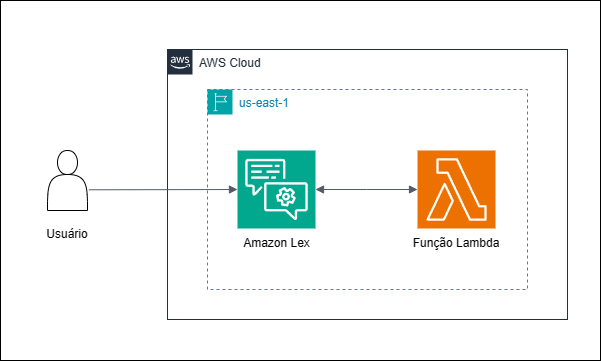

# Grupo 5 - Bot de Saúde

<p>

Com o avanço da telemedicina, surgiram diversas soluções computacionais para facilitar o atendimento na área da saúde. Este trabalho visa simular o funcionamento de um chatbot que abrange desde o cadastramento até o agendamento de consultas.
</p>

***

<h2 >🔎 Índice</h2>

- [Desenvolvimento](#desenvolvimento)
- [Dificuldades](#dificuldades-conhecidas)
- [Tecnologias](#tecnologias)
- [Arquitetura Utilizada](#arquitetura-utilizada)
- [Estrutura de Diretórios e Arquivos](#estrutura-de-diretórios-e-arquivos)
- [Como utilizar](#como-utilizar)
- [Colaboradores](#colaboradores)
***


<h2 id="desenvolvimento">👷 Desenvolvimento</h2>

O projeto foi feito utilizando utilizando 9 intents e 9 tipos de slots:

Intents:
<ul>
<li>FallbackIntent</li>
<li>Cadastramento</li>
<li>IniciarInteracao</li>
<li>outros-exames</li>
<li>saudeIntent</li>
<li>AgendarConsulta</li>
<li>medicina-do-trabalho</li>
<li>consulta-aso</li>
<li>informacoesIntent</li>
</ul>

Tipos de Slots:

<ul>
<li>CidadesDisponiveisPr</li>
<li>CidadesDisponiveisSc</li>
<li>CidadesDisponiveisRs</li>
<li>CidadesDisponiveisSp</li>
<li>EstadosDisponiveis</li>
<li>opcoes</li>
<li>EspecialidadeMedica</li>
<li>confirmacao</li>
<li>Sexo</li>
</ul>

***

<h2 id="#dificuldades-conhecidas" >⚔️ Dificuldades</h2>

Entre as dificuldades encontradas durante o processo de criação do chatbot, podemos citar:
<ul>
<li>Criação da função lambda para validação de cada campo</li>
<li>Processo de integração de cada intent</li>
<li>Lidar com bugs do próprio serviço da Amazon Lex</li>
</ul>

***

<h2 id="tecnologias" >💻 Tecnologias</h2>

<div style="display: inline_block">

  <table border="1">
    <tr><th>Tecnologia</th>
      <td> <a href="https://aws.amazon.com/pt/pm/lex/?gclid=Cj0KCQjwlZixBhCoARIsAIC745AFQJ3XvBnj_TkbW465aqRe6sgs30ch0EFhaKDFxt-tiD59S78hxcAaAquZEALw_wcB&trk=655041e6-b116-4973-9618-7789840bab2f&sc_channel=ps&ef_id=Cj0KCQjwlZixBhCoARIsAIC745AFQJ3XvBnj_TkbW465aqRe6sgs30ch0EFhaKDFxt-tiD59S78hxcAaAquZEALw_wcB:G:s&s_kwcid=AL!4422!3!652868436943!e!!g!!amazon%20lex!19909695788!147207931589"></a> Amazon Lex</td>
      <td> <a href="https://aws.amazon.com/pt/lambda/"></a> Lambda</td>
        <td> <a href="https://www.python.org/doc/"></a> Python</td>

</tr>

  </table>
</div>


***

<h2 id="arquitetura-utilizada" >⚙️ Arquitetura Utilizada</h2>



***

<h2 id="estrutura-de-diretórios-e-arquivos" >🗂️ Estrutura de Diretórios e Arquivos</h2>

- src /
  - Bot /
    - Consulta_v3 /
      - BotLocales /
        - pt_BR /
          - Intents /
            - AgendarConsulta /
            - Cadastramento /
            - consulta-aso /
            - FallbackIntent /
            - informacoesIntent /
            - iniciarInteracao /
            - medicina-do-trabalho /
            - outros-exames /
            - saudeIntent /
          - SlotTypes
            - CidadesDisponiveisPr /
            - CidadesDisponiveisSp /
            - confirmacao /
            - EspecialidadeMedica /
            - EstadosDisponiveis /
            - opcoes /
            - Sexo /
          - BotLocale.json
      - Bot.json
    - Manifest.json
  - lambda_functions /
    - lambda_agendar_consulta.py
    - lambda_cadastro.py
    - lambda_function.py
    - lambda_initial_interaction.py
    - lambda_medicina_trabalho.py
- README.md
***

<h2 id="como-utilizar" >🧑‍💻 Como utilizar</h2>

Existem duas formas de obter acesso ao chatbot:

Acessando o link do grupo do Slack:
<ol>
<li>Acesse o link abaixo do grupo do Slack (obs: é necessário ter uma conta)

```bash
https://join.slack.com/t/compass-i835746/shared_invite/zt-2gpthqt6c-K875s9u8cfDpDEyJOh2uhw
```
</li>

<li>
Em seguida, entre no app chamado de "ConsultasV2" e inicie uma nova conversa com o chatbot
</li>
</ol>

Rodando na própria AWS:
<ol>
<li>Clone o projeto do github

```bash
git clone -b grupo-5 https://github.com/Compass-pb-aws-2024-IFSUL-UFERSA/sprint-7-pb-aws-ifsul-ufersa.git
```

</li>

<li>
Navegue até a pasta src e transforme a pasta "Bot" em um arquivo zip

```bash
cd sprint-7-pb-aws-ifsul-ufersa
cd src
```
<li>Após isso, no serviço Amazon Lex vai até a parte de ações e Importar, para adicionar a pasta "Bot" dentro da sessão de Bots</li>
<li>Agora, lembre de importar o código lambda para realizar as validações de campo e conectar o próprio bot com a função</li>
<li>Em seguida, realize o Build do projeto</li>
<li>Adicione a função lambda que foi importada</li>
<li>Clique em Test e inicie uma nova conversa com o chatbot</li>


</ol>


***

<h2 id="colaboradores" >🤝 Colaboradores</h2>

<ul>
<li>Arthur Weymar Garcia</li>
<li>João Vitor Fernandes de Sales</li>
<li>Kaio Fernando Lopes Silva</li>
<li>Valentim Dutra Garcia</li>
</ul>
