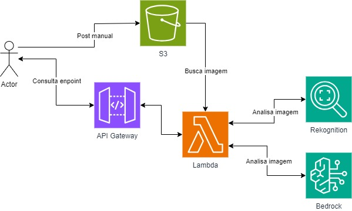
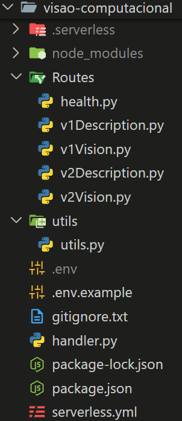

# Análise de Imagens com o Amazon Rekonigtion e geração de texto apartir do Amazon Bedrock

Este projeto consiste em criar uma aplicação serverless que apartir de uma imagem inserida dentro de um bucket retorna ou a emoção da face ou frases que combinem com a imagem

***

## Índice
- [Desenvolvimento](#desenvolvimento)
- [Dificuldades Conhecidas](#dificuldades-conhecidas)
- [Tecnologias Utilizadas](#tecnologias-utilizadas)
- [Como Utilizar o Sistema](#como-utilizar-o-sistema)
- [Arquitetura AWS](#arquitetura-aws)
- [Estrutura de Diretórios e Arquivos](#estrutura-de-diretórios-e-arquivos)
- [Integrantes](#integrantes)

***

## Desenvolvimento

O projeto foi desenvolvido em Python, utilizando uma estrutura baseada em Serverless para criar uma aplicação que apartir do bucket e do nome da imagem baseado na rota seja gerada um JSON com a emoção que a face tem, ou rótulos para imagens de pets. Após a construção das funções de cada uma das rotas, foi feito deploy e implementação das mesmas via Serverless Framework na plataforma da AWS, utilizando os serviços de API Gateway, Rekonigtion, Bedrock e Funções Lambda para funcionamento da API.

***

## Dificuldades Conhecidas:

- Problemas com o Prompt para o bedrock: Foi enfrentado alguns problemas com relação a criação do prompt para as dicas da v2, para conseguir uma resposta satisfatória do bedrock foi necessário muito tempo.


***
## Tecnologias utilizadas

<div style="display: inline_block">
  <table border="1">
    <tr>
        <th>Tecnologia</th>
        <th>Versão</th>
    </tr>
    <tr>
        <td> <a href=""></a> AWS</td>
        <td>Current</td>
    </tr>
    <tr>
        <td> <a href=""></a> AWS Lambda</td>
        <td>Current</td>
    </tr>
    <tr>
        <td> <a href=""></a> Amazon Rekognition</td>
        <td>Current</td>
    </tr>
    <tr>
        <td> <a href=""></a> Amazon Bedrock</td>
        <td>Current</td>
    </tr>
    <tr>
        <td> <a href=""></a> Serverless</td>
        <td>v.3.38.0</td>
    </tr>
    <tr>
        <td> <a href=""></a> Python</td>
        <td>v. 3.9</td>
    </tr>
    <tr>
        <td> <a href=""></a> Boto3</td>
        <td>v.1.34.74</td>
    </tr>
    </tr>
  </table>
</div>

***
## Como utilizar o Sistema

### Se o serviço estiver ativo:

Url's:

```
  GET - https://uc06urph01.execute-api.us-east-1.amazonaws.com/
  GET - https://uc06urph01.execute-api.us-east-1.amazonaws.com/v1
  GET - https://uc06urph01.execute-api.us-east-1.amazonaws.com/v2
  POST - https://uc06urph01.execute-api.us-east-1.amazonaws.com/v1/vision
  POST - https://uc06urph01.execute-api.us-east-1.amazonaws.com/v2/vision
```

- Abra o Postman
- Importe o arquivo do postman `sprint-8-pb-aws-ifsul-ufersa\tests\Sprint_08.postman_collection.json`
- Para as rotas POST no body da requisição adicione:
```
{
    "bucket": "bucket_de_exemplo",
    "imageName": "imagem.jpeg"
}
```

### Em caso de rodar localmente:

Clone este repositório
```
git clone -b grupo-2 https://github.com/Compass-pb-aws-2024-IFSUL-UFERSA/sprint-8-pb-aws-ifsul-ufersa.git
```
Baixe o Serverless Framework 
```
npm install -g serverless
npm i -D serverless-dotenv-plugin
```
Por fim adicione o bucket como variavel de ambiente e inicie a aplicação com o seguinte comando
```
serverless deploy
```

# Arquitetura AWS



***

## Estrutura de Diretórios e Arquivos
<div align= "left">
  
</div>

## Integrantes
- [Leonardo Ennes](https://github.com/LeonardoEnnes)
- [João Vitor](https://github.com/jovitif)
- [Roger Lasch](https://github.com/rogerlasch)
- [Ygor Da Rosa](https://github.com/ygordarosa)
