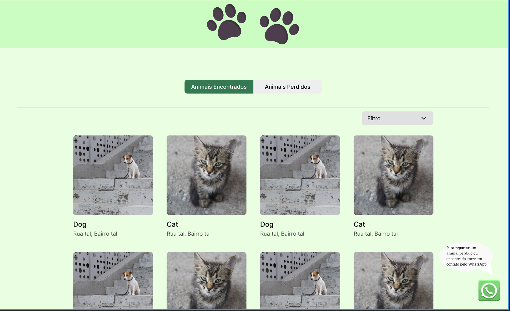
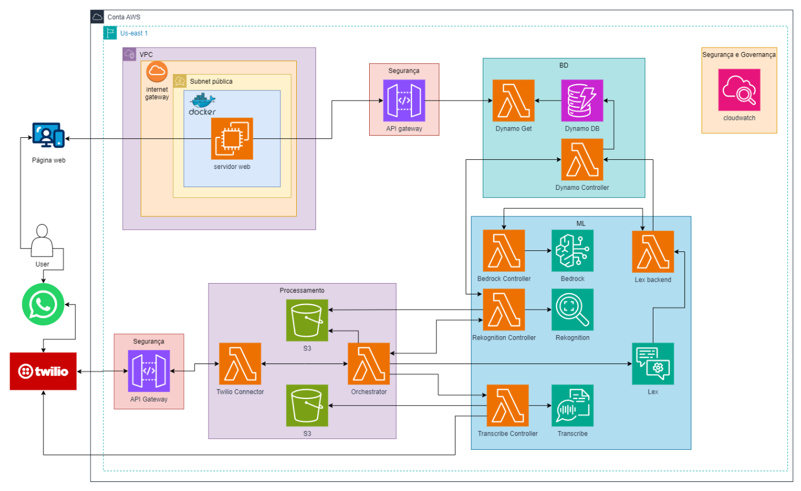
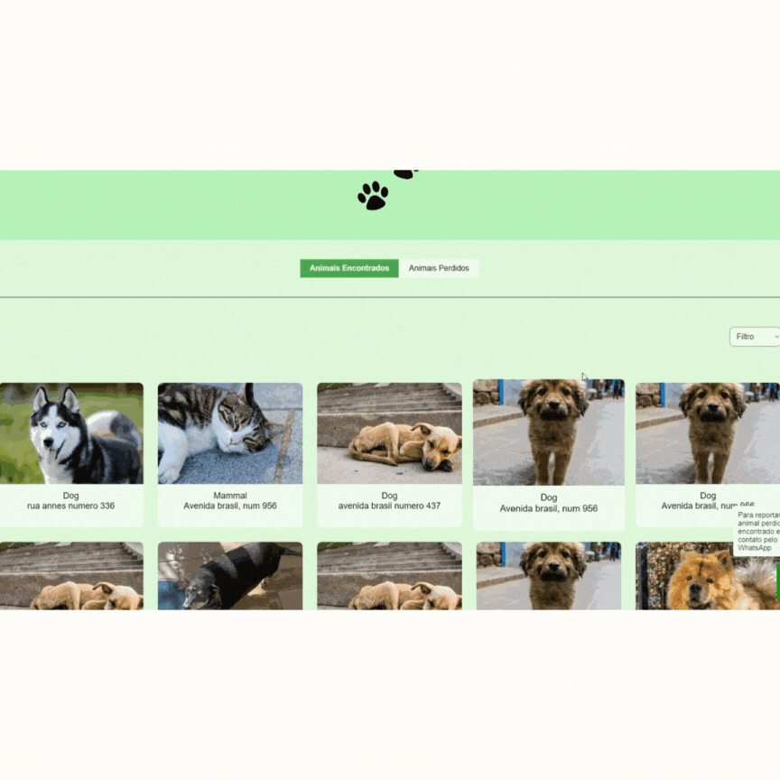

# Solução para Reencontro de Animais Perdidos: Integrando Tecnologia e Amor pelos Animais

## O problema
O desaparecimento de um animal de estimação é uma experiência devastadora, gerando sentimentos de angústia, impotência e preocupação com o bem-estar do animal. Todos os dias, milhares de animais se perdem, causando sofrimento não apenas para eles, mas também profunda aflição para seus tutores. A busca pelo reencontro é frequentemente árdua e demorada, muitas vezes sem sucesso, prolongando a dor e a incerteza para todos os envolvidos.

Além disso, a falta de uma plataforma centralizada, especializada e fácil de usar agrava ainda mais o problema. Muitas soluções existentes exigem cadastros longos e complicados, desmotivando as pessoas a utilizá-las. No ritmo acelerado dos dias atuais, poucos têm paciência para lidar com processos burocráticos, aumentando a necessidade de uma solução rápida, eficiente e confiável para esse fim.

## Proposta de Solução
Aplicação que combina a praticidade do WhatsApp com o poder da inteligência artificial para revolucionar a busca por animais perdidos.

### Ilustração da Aplicação

## Diferenciais

* **Interação Facilitada via WhatsApp:** Envie fotos e informações do animal perdido ou encontrado diretamente para o chatbot no WhatsApp.
* **Chatbot Inteligente:** Converse com o chatbot para relatar avistamentos e receber assistência na busca.
* **Duas Páginas Essenciais:**
    * **Animais Perdidos:** Publique fotos e informações do seu animal perdido, incluindo nome, sexo, características e última localização conhecida.
    * **Animais Encontrados:** Navegue por fotos e informações de animais encontrados por outros usuários. Ao clicar em um animal, visualize sua última localização, nome (se tiver coleira), sexo e outras informações relevantes, além do contato do achador.
* **Combate à Fraude com Amazon Rekognition:** Esta tecnologia garante a autenticidade das fotos e informações, combatendo fraudes e aumentando a confiabilidade da plataforma.
* **Dicas Personalizadas com Amazon Bedrock:** Receba dicas valiosas sobre o comportamento e características do animal, auxiliando na identificação e no reencontro.
* **Relato em Áudio com Extração Inteligente de Informações:** O achador pode enviar um relato em áudio sobre o animal e sua localização. Este relato é convertido automaticamente em texto, permitindo a extração inteligente de dados importantes. Essa funcionalidade torna o processo mais eficiente e eficaz, economizando tempo para o achador, que precisa se preocupar menos em preencher campos manualmente, simplificando a experiência de uso.
* **Detalhes Adicionais:** Informações extras podem ser incluídas na seção "Maiores Detalhes".

A simplicidade e eficiência dessa aplicação vêm para tornar a vida de todos os envolvidos significativamente mais fácil. Ela oferece uma solução prática e acessível, especialmente para aqueles que têm pouco tempo disponível ou que precisam de um método rápido e sem complicações para ajudar os donos a encontrarem seus queridos animais de estimação e vice-versa.

# Arquitetura

# Desenvolvimento

Durante o desenvolvimento do projeto, utilizamos uma variedade de serviços da AWS para garantir uma solução robusta e eficiente. O DynamoDB foi essencial como nosso banco de dados NoSQL não relacional, armazenando informações detalhadas sobre os animais perdidos e encontrados, incluindo fotos, descrições, localizações e dados de contato.

Para o processamento em nuvem, utilizamos o AWS Lambda, um serviço sem servidor que executa funções em resposta a eventos. O Lambda foi fundamental para processar imagens com o Amazon Rekognition, transcrever áudio com o Amazon Transcribe e orquestrar o fluxo de trabalho da aplicação. O Amazon Rekognition, um serviço de inteligência artificial que analisa imagens e vídeos, nos ajudou a verificar a autenticidade das fotos dos animais e identificar características físicas que auxiliam na busca.

O Amazon Transcribe converteu áudio em texto, permitindo o processamento de relatos em áudio enviados pelos usuários sobre animais encontrados. O texto transcrito foi utilizado para extrair informações importantes, como a localização do animal e suas características relevantes. Além disso, usamos o Amazon Bedrock, um serviço de inteligência artificial que fornece modelos pré-treinados para diversas tarefas, como classificação de texto e extração de informações. Na nossa solução, o Bedrock forneceu dicas personalizadas aos usuários sobre o comportamento e características dos animais perdidos, auxiliando na sua identificação e reencontro.

Para a interação com os usuários, implementamos um chatbot usando o Amazon Lex, um serviço que permite criar chatbots com conversas naturais. Esse chatbot interage com os usuários via WhatsApp, permitindo que relatem avistamentos de animais perdidos ou encontrados e recebam assistência na busca. Para conectar o chatbot Lex com o WhatsApp, utilizamos o Twilio, uma plataforma de comunicação em nuvem que permite integrar diferentes serviços de mensagens.

Na construção da página web da solução para o reencontro de animais perdidos, utilizamos Node.js, desempenhando um papel fundamental na implementação de diversas funcionalidades e na otimização da experiência do usuário, centralizando informações sobre animais perdidos e encontrados.

# Dificuldade conhecidas

A documentação oficial da Twilio foi considerada insuficiente e pouco intuitiva, exigindo que a equipe buscasse informações em fóruns online, tutoriais e outras fontes alternativas para entender e implementar adequadamente as funcionalidades da plataforma. A implementação de uma arquitetura de microserviços eficiente também foi um desafio, exigindo conhecimento técnico aprofundado e um planejamento cuidadoso para garantir uma comunicação eficaz entre os microserviços, evitando gargalos de performance e problemas de confiabilidade. Além disso, conciliar o tempo dedicado ao desenvolvimento da solução com a preparação para a certificação foi uma das dificuldades encontradas pela equipe.

# Como utilizar o sistema

Para utilizar o serviço do nosso projeto, basta acessar o link http://18.204.104.126:3000/. Através dessa página, você poderá encontrar o caminho para o chatbot no WhatsApp e reportar animais perdidos ou encontrados, além de buscar informações sobre os animais já cadastrados na nossa base de dados. Nossa plataforma foi projetada para facilitar o reencontro de animais perdidos, utilizando tecnologias avançadas para fornecer a melhor experiência possível.

# Imagens da aplicação desenvolvida

## Página Web

## Chatbot para animais encontrados

## Chatbot para animais perdidos

